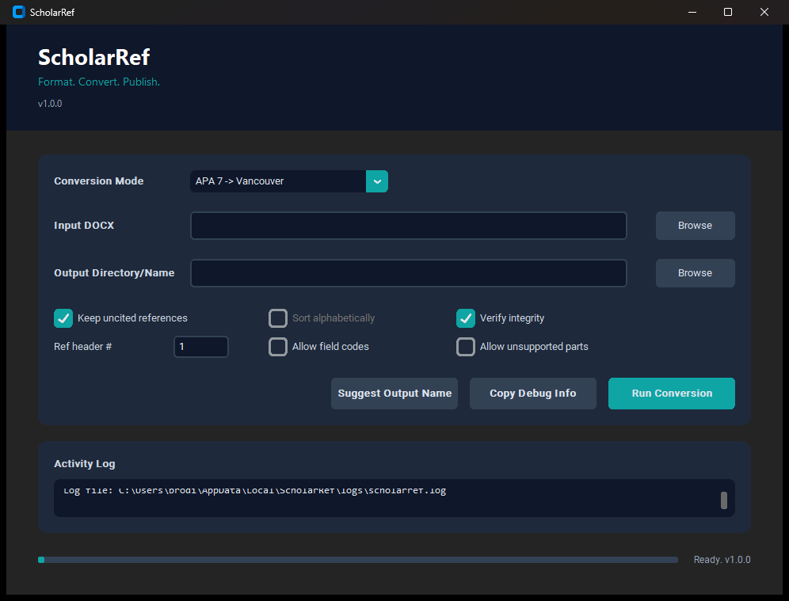

<div align="center">


# ScholarRef

Format. Convert. Publish.

</div>

ScholarRef is a Windows-first `.exe` app for converting citation styles inside existing Word `.docx` manuscripts and verifying the output for structural and reference integrity.



## Windows app

Primary distribution:

- `ScholarRef-setup-<version>.exe`: standard Windows installer
- `ScholarRef.exe`: packaged desktop app inside `ScholarRef-windows-x64.zip`
- `SHA256SUMS.txt`: release checksums

Target compatibility:

- Windows 11 x64
- Windows 10 x64

Expected runtime:

- normal non-admin user install
- `.docx` input/output workflow
- logs under `%LOCALAPPDATA%\ScholarRef\logs\scholarref.log`

Current release model:

- unsigned freeware build
- download from GitHub Releases only
- verify `SHA256SUMS.txt` before sharing or mirroring
- Windows SmartScreen may show `Unknown publisher`

See [docs/windows-trust-and-signing.md](docs/windows-trust-and-signing.md).

## Supported conversions

- APA 7 <-> Vancouver
- Harvard <-> Vancouver
- APA 7 <-> Harvard

## Core functionality

- Rewrites in-text citations and reference lists across supported style pairs.
- Normalizes corrupted and hybrid reference lists before rebuilding them into a coherent target style.
- Detects all-caps reference headers and can infer an untitled reference list automatically.
- Preserves and reuses numbering for repeated sources in Vancouver mode.
- Runs strict verification passes to catch citation/reference mismatches and style remnants.
- Provides a desktop GUI for non-terminal use.

## Install options

### Recommended for normal users

Download the latest Windows release artifact from GitHub Releases:

- `ScholarRef-setup-<version>.exe`
- `SHA256SUMS.txt`

If Windows warns that the publisher is unknown, that is expected for the current unsigned release model. The trust check is:

1. download only from GitHub Releases
2. verify the SHA-256 hash
3. compare it with `SHA256SUMS.txt`

### Portable Windows build

Download and unzip:

- `ScholarRef-windows-x64.zip`

Then run:

- `ScholarRef.exe`

### Python install

Requirements:

- Python 3.9 or higher

Install from the repository root:

```bash
pip install .
```

## Quick start

### GUI

Run the installed app or packaged `ScholarRef.exe`.

Packaged Windows builds write logs to `%LOCALAPPDATA%\ScholarRef\logs\scholarref.log`, and the GUI includes `Copy Debug Info` for bug reports.

### CLI

Run:

```bash
python scholarref.py --mode apa7-to-vancouver --input "input.docx" --output "output.docx"
```

Supported `--mode` values:

- `apa7-to-vancouver` (`a2v`)
- `harvard-to-vancouver` (`h2v`)
- `vancouver-to-apa7` (`v2a`)
- `vancouver-to-harvard` (`v2h`)
- `apa7-to-harvard` (`a2h`)
- `harvard-to-apa7` (`h2a`)

## Verification engine

Validate converted output against a source document:

```bash
python verify_reference_integrity.py --source "source.docx" --output "output.docx" --profile references-only
```

Profiles:

- `references-only`: strict public integrity checks for ScholarRef conversion outputs
- `full`: optional private manuscript-wide checks not included in the public GitHub package

## Safety preflight checks

Before rewriting any file, ScholarRef checks for:

- explicit or inferred reference-list boundaries
- reference manager field codes
- unsupported regions such as text boxes, footnotes, or endnotes
- ambiguous author/year cases that need disambiguation

## Local packaging

Build the app bundle and portable zip:

```powershell
powershell -ExecutionPolicy Bypass -File .\scripts\build_windows.ps1
```

Build the installer, checksums, and release manifest:

```powershell
powershell -ExecutionPolicy Bypass -File .\scripts\build_windows_installer.ps1
```

Smoke test the installer silently:

```powershell
powershell -ExecutionPolicy Bypass -File .\scripts\test_windows_installer.ps1
```

## Windows release process

- Release checklist: [docs/windows-release-checklist.md](docs/windows-release-checklist.md)
- Trust and signing: [docs/windows-trust-and-signing.md](docs/windows-trust-and-signing.md)

## License

MIT License. See [LICENSE](LICENSE) for details.
