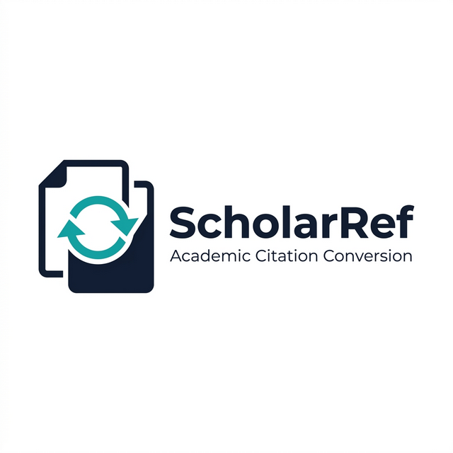

<div align="center">



# ScholarRef

**Format. Convert. Publish.**

 

</div>

ScholarRef converts citation styles inside existing Word `.docx` manuscripts and verifies the output for structural and reference integrity.

## ✨ Supported Conversions

* **APA 7** 🔄 **Vancouver**
* **Harvard** 🔄 **Vancouver**
* **APA 7** 🔄 **Harvard**

---

## 🚀 Core Functionality

🔹 **Bidirectional Translation:** Rewrites in-text citations and reference lists across the supported style pairs.
🔹 **Smart Numbering:** Preserves and reuses numbering for repeated sources automatically when converting to Vancouver mode.
🔹 **Aggressive Verification:** Runs strict verification passes to catch citation/reference mismatches, ordering errors, and style remnants.
🔹 **Modern App Interface:** Provides an optional desktop GUI for smooth, non-terminal use.

---

## 💻 Installation

**Requirements:**
- Python 3.9 or higher

Install directly from the repository root using pip:

```bash
pip install .
```

---

## ⚡ Quick Start

### Using the GUI
The easiest way to perform a conversion is via the Modern Desktop Interface. Once installed, simply run:

```bash
scholarref-gui
```

### Using the CLI
Run the conversion tool directly from your terminal:

```bash
python scholarref.py --mode apa7-to-vancouver --input "input.docx" --output "output.docx"
```

<details>
<summary><b>View all Supported `--mode` flags</b></summary>

- `apa7-to-vancouver` *(alias: `a2v`)*
- `harvard-to-vancouver` *(alias: `h2v`)*
- `vancouver-to-apa7` *(alias: `v2a`)*
- `vancouver-to-harvard` *(alias: `v2h`)*
- `apa7-to-harvard` *(alias: `a2h`)*
- `harvard-to-apa7` *(alias: `h2a`)*
</details>

---

## 🛡️ Verification Engine

You can manually verify converted output against a source document to ensure strict matching:

```bash
python verify_reference_integrity.py --source "source.docx" --output "output.docx" --profile full
```

### Supported Profiles:
- **`full`:** Manuscript-wide checks (headers, ordering, citations, declaration remnants, figure/caption flow checks, reference integrity).
- **`references-only`:** Strict reference-style integrity checks tailored explicitly for conversion outputs.

---

## ⚠️ Safety Preflight Checks

Before rewriting any file, `scholarref.py` enforces several automated checks to avoid silent errors:

- **Multiple References Headers:** Detects if a document has multiple bibliographies; allows you to explicitly target one via `--ref-header-n`.
- **Field Codes:** Halts automatically if reference-manager field codes (like Zotero, EndNote, or Mendeley) are detected, preventing file corruption.
- **Unsupported Regions:** Detects citation-like content trapped inside text boxes, footnotes, or endnotes.
- **Ambiguity Detection:** Explicitly flags identical author/year citations that require `a/b` disambiguation.

---

## 📂 Repository Conventions

- `.docx`, `.doc`, and `.pdf` files are ignored automatically via `.gitignore`.
- Citation metadata for this software can be found in `CITATION.cff`.
- Contribution and security policies are located in `CONTRIBUTING.md`, `CODE_OF_CONDUCT.md`, and `SECURITY.md`.

---

## ⚖️ License

**All Rights Reserved.** See `LICENSE` for details.

*This repository is explicitly closed-source and not licensed for unauthorized modification, derivative work, or redistribution without written permission from the author.*
